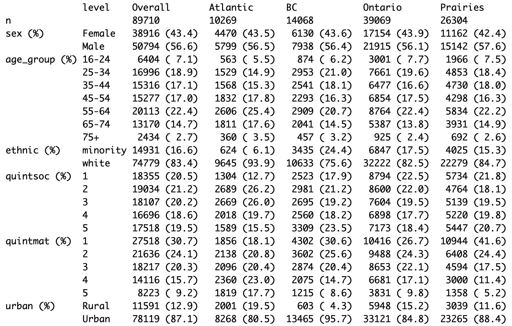

\newcommand{\1}{\textbf{1}}

Yuan Yu^1^, Matthew J. Knight^1^, Sheila F. O'Brien^2^, David L. Buckeridge^1,3^, W. Alton Russell^1,3^


<br>

^1^School of Population and Global Health, McGill University, Montreal, Canada

^2^Canadian Blood Services, Ottawa, Canada

^3^COVID-19 Immunity Task Force, Montreal, Canada

<br>

**Corresponding author:** W. Alton Russell [alton.russell\@mcgill.ca](mailto:alton.russell@mcgill.ca){.email}, +1-514-396-1476

Suite 1200, 2001 McGill College Avenue, Montreal, QC, Canada H3A 1G1


**Key words:** Blood Donor; COVID-19; Surveillance; Bayesian multilevel regression; CAR

**Running title:**

##### 

```{r setup, include=FALSE}
library(ggplot2) #plots
library(data.table) #for using datatables instead of frames
library(scales) #formatting plot legends and text
library(readxl) #read.excel
library(flextable) #generating tables
library(ftExtra)
library(officedown) #formatting for word
library(officer)
library(stringr)
library(kableExtra)
theme_set(theme_bw())
knitr::opts_chunk$set(
  echo       = FALSE,
  message    = FALSE,
  warning    = FALSE
)

#takes table column containing references for sources
gen_tab_sourcestr <- function(sources_raw){
  sources <- str_match(sources_raw, ".*\\[@\\s*(.*?)\\s*\\]")[,2]
  #remove NA
  sources <- sources[!is.na(sources)]
  #attack '@
  sources <- paste0("@", sources)
  #add commas
  sources[-length(sources)] <- paste0(sources[-length(sources)], "; ")
  sources <- paste0("[", paste0(sources, collapse=""), "]")
  return(sources)
}

```

```{r}
df_samp <- read_excel("../1_data/tables.xlsx", sheet = "sample")
sourcestr_t_samp <- gen_tab_sourcestr(df_samp$Source)
x = read.csv("/home/yuanyu/projects/covid_donors_3waves/1_data/tableone_predelta.csv")
```

# Abstract (~250)
Canadian Blood Services (CBS) is monitoring COVID-19 immunity levels in in the largest continuous seroprevalence study in Canada through the testing of randomly selected blood donations. While blood donors are a convenient and cost-effective group for public health surveillance, their characteristics may not reflect those of the general population. Therefore, it is important to evaluate and adjust for any potential biases. In this study, we assessed the correlation between demographic covariates and SARS-CoV-2 seropositivity across three pandemic waves (Pre-Delta, Delta, and Omicron) in four regions (Ontario, British Columbia, Prairies region and Atlantic region). We also compared multilevel modeling approaches with or without spatial effects. We found that Bayesian multilevel models with conditional autoregressive (CAR) priors consistently achieved better fitting by having the lower posterior predictive error in SARS-CoV-2 seropositivity when using individual factors and spatial factors. Our findings highlight how Bayesian multilevel modeling using antibody test data can provide valuable insights into population COVID-19 immunity levels, informing policy making.

#####

# Introduction
The ability to accurately identify and document positive cases is an essential component of any successful surveillance system. Since most cases of SARS-CoV-2 do not require active care, governments and public health organizations have been forced to modify existing surveillance measures to accurately monitor SARS-CoV-2 in the general population. Surveillance programs have since provided vital information to policymakers regarding infection prevalence, vaccine coverage, and antibody waning [@manuel_role_2021; @ward_population_2022]. Testing of blood samples collected for donation or other healthcare purposes have contributed significantly towards SARS-CoV-2 surveillance within Canada and abroad [@saeed_sars-cov-2_2021; @charlton_pre-vaccine_2021; @obrien_expanded_2023]. Blood sample surveillance can model temporal patterns, infection prevalence, and highlight differences in disease dynamics across subgroups [@saeed_sars-cov-2_2021]. 

Before the SARS-CoV-2 pandemic, multiple countries had already used blood donor samples for public health surveillance. Denmark established a national blood donor cohort across all donation centers to monitor changes in health status among a relatively healthy population [@erikstrup_cohort_2022]. Blood donor samples have previously been used to estimate the incidence of Chikungunya virus in Puerto Rico and are currently being explored for use in surveillance of other infectious diseases [@simmons_high_nodate; @custer_surveillance_2023]. Blood donors present several advantages for population health surveillance, including access to repeated donations over time, low cost, and ability to rapidly increase testing capacity. However, factors such as the use of different measurement assays and low positive case counts in some regions can obscure estimation of some parameters such as seroprevalence [@tuite_estimating_2022].

Population seroprevalence of natural infection to SARS-CoV-2 is typically characterized using assays testing for antibody response to the nucleocapsid (anti-N) of the SARS-CoV-2 virus. Previous studies have found that population seroprevalence is sensitive to factors including sampling frame, location, occupation, and other demographic characteristics [@bobrovitz_global_2021; @skowronski_serial_2022]. However, identifying significant predictors of seroprevalence is an equally important surveillance task as it aids resource allocation. Within Canada, anti-N seropositivity has been associated with belonging to a visible minority group and residing within regions experiencing social and/or material deprivation [@reedman_changing_2022]. Geographic variation in predictors of anti-N seroprevalence has also been observed. Using a cohort of blood donors across nine Canadian provinces, O’Brien et al. identified belonging to a visible minority was significantly correlated with higher rates of seropositivity in only Ontario, British Columbia, and the Atlantic provinces [@obrien_cross-canada_2023]. However, population-based seroprevalence studies face several challenges, including small sampling area and use of multiple different detection assays, which may skew estimates [@tuite_estimating_2022; @goldfarb_sars-cov-2_2022; @lewin_sars-cov-2_2021]. In addition, blood donors differ from the general population on characteristics such as overall health status, which may reduce generalizability [@atsma_healthy_2011]. Application of Bayesian multi-level modeling methods which adjust for these biases may provide more accurate seroprevalence estimates when using blood donor data.  

A considerate amount of samples were collected by Canadian blood services and being utilized for the SARS-CoV-2 antibody testing for disease surveillance since the very beginning of the pandemic. Covid-19 pandemic lasts over two years during which several variants of the SARS-CoV-2 dominants the infections of the community and different provinces have conducted different prevention strategies like suggesting wearing mask, lock downs and vaccination distribution etc. in response to the spread of the SARS-CoV-2 in a shorter period. While the possibility of an individual being infected is also quite related to whether remote working opportunities are available, the neighborhood he/she lives in, education level and social and material deprivation status etc. The surveillance for areas are challenging, it is worth to borrow information across neighboring counties to get more accurate county level seropositivity estimation. On the other hand, the corresponding covariates may not always available, utilizing the spatial model may account for the unknown spatial confounding compared to the general mixed effects model and facilitates a better fitting, which may result in different understanding of the overall social demographic features for the policy makers in general. 

The current study aimed to estimate individual- and neighborhood-levels predictors of anti-N seroprevalence using a large cohort of Canadian blood donors from nine Canadian provinces. Several fixed and random effects multilevel regression models were compared to identify significant predictors of seropositivity tested by Roche assay during the pre-Delta (December 14 2020 – August 1 2021), Delta (August 1 2021 – December 15 2021), and Omicron (December 15 2021 – December 1 2022) pandemic waves.  

# Methods

Generalized linear model with both fixed effects, regular random effects (unstructured) and structured random effects are used to compare the seropositivity estimation across counties as well as the model fitting in Widely applicable information criterion (WAIC) score. Conditional autoregressive prior to construct the relationship between the geographical areas. Estimation results from shorter time range break is also calculated to evaluate the coefficient change according to the progression of the pandemic. Table One of the population distribution according to different individual or areal level covariates for all the targeted regions for each wave are provided.

## Data

We used the donation data across major stages (pre-delta, delta, omicron) of the pandemic from pre-delta period started from December 2020 to the late omicron which is December 2022 of four regions across Canada excludes Quebec. They are Ontario, British Columbia, the prairies region which includes Alberta, Saskatchewan, Manitoba, and the Atlantic region consists of New Brunswick, Newfoundland and Labrador, Nova Scotia, and Prince Edward Island. Since the seropositivity at the FSA level is too fine to arouse interest, it is more meaningful to obtain the county level seropositivity estimation. Knowing the fact that we only have the geographic information of the fsa level, while for some FSA area could be mapped to multiple census divisions, thus we develop a strategy to map the FSA to the census division proportional to the the census population at the donor level. We drop the donations with the missing demographic or geographic information. Since there are also situations that people fill out their hometown address while living in the areas they work or attend schools, we also drop the census divisions that has less than 5 donations in total. In the end, a total number of 420,320 donations from 239346 donors during the 24 months of the pandemic period were utilized into the analysis. 

## Modeling method
$$
\begin{aligned}
\min_{\textbf{z}, \textbf{M}, \textbf{A}} \quad & \E [\C(\textbf{z}, \textbf{M}, \textbf{A} \mid \textbf{P})]\\
\textrm{s.t.} \quad & m_{li} = a_{ji} = 0 \quad \forall l,j \quad \text{ when } \quad z_i=0
\end{aligned}
$$
$$
(z, a \mid p)] = (1-z)d + z\bigg(w + a\phi + ag(rp + (1-q)(1-p)) + (1-ra)pc  \bigg).
$$
$$
\begin{aligned}
y_{kj} &\sim {\sf Binomial}(n_{kj}, {\theta}_{kj}) \quad k=1, ..., K, \quad j=1,...,n_k\\\\
\ln({\theta}_{kj}/(1-{\theta}_{kj})) & = \mathbf{x}_{kj}^\top\mathbf{\beta}, \quad k=1,...,K, \quad j=1,...,n_k\\\\
p(\mathbf{\beta}_p) &\propto 1,\quad-\infty < \beta_p < \infty,\quad p=0,.., 6\\
\end{aligned}
$$
$$
\begin{align*}
y_{kj} &\sim \text{Binomial}(n_{kj}, {\theta}_{kj}),\quad k=1, ..., K, \quad j=1,...,n_k\\
\ln({\theta}_{kj}/(1-{\theta}_{kj})) & = \mathbf{x}_{kj}^\top\mathbf{\beta}, \quad k=1,...,K, \quad j=1,...,n_k\\
p(\mathbf{\beta}_p) &\propto 1,\quad-\infty < \beta_p < \infty,\quad p=0,.., 6\\
\end{align*}
$$

$$
\begin{aligned}
y_{kj} &\sim \text{Binomial}(n_{kj}, {\theta}_{kj}) \quad k=1, ..., K, \quad j=1,...,n_k\\
\ln({\theta}_{kj}/(1-{\theta}_{kj})) & = \mathbf{x}_{kj}^\top\mathbf{\beta} + \alpha_k, \quad k=1,...,K, \quad j=1,...,n_k\\
p(\mathbf{\beta}_p) &\propto 1,\quad-\infty < \beta_p < \infty,\quad p=0,.., 6\\
\alpha_k &\sim N(\alpha_0, \sigma_k), \quad k=1, ..., K,\\
\alpha_0 &\sim t(3, 0, 2.5), \quad k=1, ..., K, \\
\sigma_k &\sim t(3, 0, 2.5),\quad \sigma_k > 0, \quad k=1, ..., K \\
\end{aligned}
$$

$$
\begin{align*}
y_{kj} &\sim \text{Binomial}(n_{kj}, {\theta}_{kj}) \quad k=1, ..., K, \quad j=1,...,n_k\\\\
\ln({\theta}_{kj}/(1-{\theta}_{kj})) & = \mathbf{x}_{kj}^\top\mathbf{\beta} + \phi_k, \quad k=1,...,K, \quad j=1,...,n_k\\\\
p(\mathbf{\beta}_p) &\propto 1,\quad-\infty < \beta_p < \infty,\quad p=0,.., 6\\
\phi_k | \phi_{i},i\neq k, \tau_k &\sim N \left( \frac{\sum_{k \sim i}\phi_k}{d_{k,k}},\frac{1}{d_{k,k}\tau_k} \right), \quad k=1, ..., K,\\
(1/\tau_k)^{1/2} &\sim t(3, 0, 2.5) \quad k=1, ..., K\\
\end{align*}
$$
where $d_{k,k}$ is the number of neighbors for region $k$. The individual spatial random variable $\phi_k$ which has a set of $d_{k,k}$ neighbors is normally distributed with a mean equal to the average of its neighbors, with the variance decreases as the number if neighbors increases. 

$$
\begin{align*}
y_{kj} &\sim {\sf Binomial}(n_{kj}, {\theta}_{kj}) \quad k=1, ..., K, \quad j=1,...,n_k\\
\ln({\theta}_{kj}/(1-{\theta}_{kj})) & = \mathbf{x}_{kj}^\top\mathbf{\beta} + \psi_k, \quad k=1,...,K, \quad j=1,...,n_k\\
\mathbf{\beta} &\sim N(\mu_\beta, \Sigma_\beta),\\
\phi&\sim N ( 0, [\tau(D-\alpha W)]^{-1}), \quad \\
\tau &\sim In\\
\end{align*}
$$


We are particularly interested at investigating how the social demographic features influence the SARS-CoV-2 across different regions of Canada for each wave. Besides the demographic or the geographic covariates, time trend is also a significant factor to be taken into account, so we also incorporate the sample month into the regression model. We mainly focus on the comparison of the models utilizing the spatial information. Multilevel Regression with the regular fixed effects, as well as different unstructured or structured random effects (ICAR prior) are evaluated to fit the CBS data across four major regions (Ontario, British Columbia, the Parries region and the Atlantic Region) during three pandemic waves (Pre-delta, Delta & Omicron). We conducted our analysis through brms [@brms_2017] which allows comparing varies GLM. 

<br>

# Results

Based on the binary outcome from the anti-N tested results, we fit with generalized linear model with the logit link function. The linear portion of the GLM will incorporate both individual and the areal level covariates, together with sampling month to take care of the increasing trend as the virus spread. It is always challenging to include all the significant factors into the regression model to achieve the best fit, thus a more accurate insight of the coefficient estimation, however spatial correlation among the neighboring counties could be utilized to capture the spatial confounding to obtain a more reliable understanding of each demographic feature. The relationship between the adjacent counties could be incorporated through a conditional autoregressive prior which the probability of observing a positive sample in one area is associated with the SARS-CoV-2 seroprevalance from the areas that share borders. We also fitted with adding the regional random effects which is unstructured just in order to compare with the model with CAR prior. The convergence diagnostic is carefully checked for all the corresponding parameters involved in the Bayesian models, with most of the largest r-hat equal to 1 and several cases reach to 1.01 which rarely observed.

## Predictors of seropositivity by region and wave
Overall, material deprivation seems to be positively associated with seropositivity except for the Atlantic region where a few samples collected, while the social deprivation tends to be negatively associated with the seropositivity. This result in general aligns with the common sense that people living in areas that are least lack of material resources associated with low education, insecure job situation and insufficient incomes, and most socially separated with other people will be less likely to be tested positive. (Figure 1)

## Predicitons by census division
Taking the county level estimation from Ontario for example, in general the generalized linear model accounting for the spatial correlation provides more accurate estimation compared to the regular GLM without incorporating any geographic information at all, seeing from the fact that the posterior mean is more closed to the observed value of seropositivity for most of the counties and it always falls within the 95% of the HPD interval from the spatial model. However, the regular GLM fails to capture the true value for certain counties even though regardless of the sample size. Similar results apply for other regions as well (Figure 2). 

<br>

# Discussion

Overall the material deprivation seems to positively associated with the anti-N seropositivity and social deprivation index seems to be negatively associated with the seropositivity for major regions of Canada, though the effect of material and social deprivation is not significant for Ontario, British Columbia (BC) and the Prairies. [@lefebvre_socioeconomic_2023] While for Atlantic region, the sign of the estimation coefficient of the material deprivation is not consistent with the other regions through the pandemic. Typically during the Delta period, it shows a positive effect for the social deprivation and the seropositivity unlike the other regions. This is caused by the fact that fewer data available from the Atlantic region until the omicron started, so the coefficient estimation from the regression model will not be reliable based on small sample. Again except for the Atlantic region which lacks enough sample to provide reliable understanding of the coefficient, regarding the individual characteristics for first two waves of the pandemic, age has significant negative effect on the seropositivity, with the estimation centered around -0.02 for the delta period and -0.03 for the omicron. The coefficients are small due to applying the original scale of the age instead of grouping it into the age categories. Belonging to white racial group tends to be less likely to be tested positive, while the effect is not significant for the prairies region during pre-delta and delta period. Male group are more likely to have significant positive effect on test positive result except for the samples from the prairies region during the delta wave, which presents negative effect in general, being inconsistent with other regions. In conclusion, the younger non-white male tends to have higher seropositivity across all waves. 

In general, the coefficient estimation from the general linear model with/without the structured spatial random effect is much closed and for some circumstances GLM with spatial effect will break the significance of the effect of the material and social deprivation especially for Ontario and BC. However for the individual covariates age, race and sex, the significance of the estimation from different models always remain consistent. Since the material and social deprivation index quantile are all mapped from the census dissemination area level, and urban/rural indicator is calculated from the second digit of the postal code, it makes sense that the areal level covariates are more sensitive to adding the spatial random effect compared to the individual covariates age, race and sex. It is also interesting to find that only for the Prairies living in urban tends to have significant negative association with seropositivity across all the pandemic period. However, except for the estimation for the Atlantic region omicron wave from the glm with spatial effect, living in urban has no significant effect on the seropositivity. Breaking the time period into a three months period across the 24 months during the pandemic allows us to take a further look of how the areal or individual level effect on the seropositivity change overtime as the pandemic develops, combining in three-month is chosen to reflect the estimation trend overtime while assuring a enough sample size for obtaining the reliable estimation from the regression model. Living in urban significantly negatively affects the seropositivity for the prairies region (Figure S1), while for the estimation of BC and Ontario, there is a trend of increasing to the positive side at mid delta period and then slowly towards to the other side at the end of the omicron study at the November 2022. The trend is expected as in the earlier stage, people living in urban areas may suffer from more exposure of the virus till the gradually opening of the community during late omicron period, when the coefficient estimation tends to vanish as the people living in urban rural areas may interact more. We can observe similar diminishing effects for the material deprivation, however for social deprivation the effect is not pronounced at the latter half of the pandemic. Similar tendency is observed for the sex character, for the prairies and BC the race differences seem to decrease with time till the earlier period of Omicron and then started to increase but still remain at the negative side as the pandemic progresses. On the other hand, the age effect remains significant at around -0.025 and become more stable at the later stage of the pandemic  (Figure S2). The county level seropositivity estimation from the the glm model with the spatial random effect is more closed to the observed seropositivity for most of the counties especially given enough sample size, as is shown by Figure S2 of Ontario and BC throughout all three waves (Figure 2).

Generalized linear model (GLM) framework with logit link function is applied for modeling the relationship between the  binary response variable and various types of covariates, which serves as a base comparison model to hierarchical models with utilized the geographical information of census division identifier or further the neighboring information between the divisions. Widely Applicable Information Criterion (WAIC) is used to compare the Bayesian model fitting result, lower values indicate better model performance in terms of balancing goodness-of-fit and model complexity. It shows that except for the Atlantic region during the Delta wave when there is few positive cases, the GLM with spatial random effect (CAR prior) consistently fitted better compared to the GLM, a little bit better than the model with only the cluster random effect being incorporated. Since we do not have strong preferences or prior beliefs of the parameters involved in the hierarchical models, non-informative flat priors for coefficient parameters and weakly informed prior t(3, 0, 2.5) for the hyperparameter for intercept and standard deviation are being used. That might be the reason why the structured spatial effect only has a slight edge over the GLM with the regular grouping random effect. (Table 1) 

We can also get the similar understanding for the individual level covariates from both the modeling results (Figure 1, panel B) and the one comes with aggregated results (Figure S4). There exists a weird performance of the prairies region that the rural seropositivity is comparatively higher than the urban area. The result showing in Figure 1, panel A and Figure S1 is consistent with the aggregated result grouped by category in Figure S3, demonstrating the comparatively huge discrepancy between the urban and rural areas of the prairies region, and the plots look similar withholding one or two among Alberta, Saskatchewan and Manitoba that together make up the prairies. The extremely lower proportion of the reported vaccination within three months recorded by the Canadian Blood Services might be the potential cause for the gap, especially started from the Delta wave (Figure S5). While the donor reported vaccination rates varies little regarding the individual characteristics  (Figure S6). Considering the fact that the reported vaccination rate in the Pre-Delta for both BC and the Atlantic region is very similar, another interpretation of this disparity especially happens in the prairies region is the outbreak happened in April 2020 at a meat-packing plant in High River, being located in rural area of Alberta, which result in the leading seropositivity of the rural over the urban area. However, as there is unbalanced donation population between rural and urban areas, other potential risk factor effect on a certain smaller population in prairies rural area could also be another interesting aspect to be investigated.

# Conclusion

The Canadian Blood Services (CBS) plays a major role in monitoring COVID-19 immunity levels in Canada through the testing of randomly selected blood donations. In this study, we assessed the correlation between demographic covariates COVID-19 seropositivity across three pandemic waves (Pre-Delta, Delta, and Omicron) in four regions (Ontario, British Columbia, Prairies region and Atlantic region). We also compared multilevel modeling approaches with or without spatial effects.
We found that Bayesian multilevel models with conditional autoregressive priors explained most of the variation in COVID-19 seropositivity when using individual factors and spatial factors. Our findings highlight how Bayesian multilevel modeling using antibody test data can provide valuable insights into COVID-19 immunity levels in the population, informing policy making.  It is crucial to control the increasing seropositivity by adding the month covariate, especially during Omicron period as the significant trend involves. Though it is counterfactual from our initial guess that people from urban areas are more likely to be infected by living under larger population density, it indicates that we might need to incorporate other covariates like vaccination status and more general self-precaution being carried out. It is also showed from other studies that the high seropositivity may cause by less precautions from rural areas. 

We used individual covariates (age, sex, race) and neighborhood covariates (urbanicity, material and social deprivation) to predict COVID seropositivity. Multilevel modeling with structured random effects consistently provides a better model fit across the regions during each of the three waves, compared with generalized linear model with just fixed effects or the unstructured random effect only. However, the coefficient estimation from the posterior distribution shows that donation from a rural area tends to result in a higher seropositivity, especially for the Prairies region.

<br>
[@paudel_influence_2022],
[@yiqing_xia_geographic_2022],
[@lefebvre_socioeconomic_2023],
[@lee_carbayes_nodate],
[@konstantinoudis_regional_2022],
[@xu_comparing_2014],
[@besag_bayesian_1991],
[@djeudeu_multilevel_2022],
[@bucyibaruta_community-level_2022],
[@tang_assessment_2022],
[@byambasuren_comparison_2021],
[@duncan_spatial_2017],
[@earnest_evaluating_2007],
[@reedman_changing_2022],
[@mets_spatial_2017],
[@bryan_multilevel_2016],
[@noauthor_containing_2021],
[@konstantinoudis_regional_2022],
[@barros_importance_2023],
[@charlton_pre-vaccine_2021], 
[@lewin_research_2022], 
[@obrien_how_2022], 
[@pampalon_area-based_2012],
[@obrien_sars-cov-2_2023],
[@obrien_sars-cov-2_2022],
[@welch_detection_2001],
[@aaskov_surveillance_1998],
[@murphy_west_nodate],
[@murphy_evolution_2023],
[@sharma_surveillance_2018],
[@martinez-beneito_socioeconomic_2023],
[@sannigrahi_examining_2020],
[@ingen_neighbourhood-level_2022],
[@marine_barjoan_impact_2023],
[@k_associations_2017],
[@bergeri_global_2022],
[@chen_serological_2021],
[@government_of_canada_population_2018]


##### 

# Declarations

**Funding:** This work is founded by Canadian Blood Services (CBS)

**Conflicts:** none declared

**Ethics/Consent:** This research is approved by IRB of McGill university

**Data and materials:** Data is provided by COVID-19 Immunity Task Force (CITF)

**Code availability:** A

**Authors' contributions:**

##### 

# References

::: {#refs}
:::

##### 

# Tables

## WAIC by model type, region and wave
```{r echo=FALSE}
stab_num <- run_autonum(seq_id = "stab", 
                       pre_label = "Table ", 
                       bkm="t-tripod",
                       bkm_all = TRUE,
                        prop = fp_text(bold=TRUE, underlined = TRUE, italic = FALSE))
set_flextable_defaults(na_str = "NA", nan_str = "NaN")
t_tripod <- flextable(read.csv("/home/yuanyu/projects/covid_donors_3waves/1_data/tb2.csv"))
t_tripod <- set_header_labels(t_tripod,
  values = list(
    Urban.1 = "Urban",
    Rural.1 = "Rural",
    Urban.2 = "Urban",
    Rural.2 = "Rural"
  )
)

t_tripod <- align(t_tripod, align = "center", part = "all")
t_tripod <- fontsize(t_tripod, size = 8, part = "all")
t_tripod <- bg(t_tripod, bg = "#EAEAEA", part = "header")
t_tripod <- width(t_tripod, 1, 1.5)
t_tripod <- width(t_tripod, 2, 1.5)
t_tripod <- width(t_tripod, 3, 1.5)
t_tripod <- width(t_tripod, 4, 1.5)
t_tripod <- theme_box(t_tripod)
t_tripod <- set_caption(t_tripod, "Waic score from different models per region/wave.",
                         autonum=stab_num)
t_tripod <- theme_box(t_tripod)
t_tripod
```

<!---BLOCK_LANDSCAPE_START--->
# Figures
## Coefficients for individual and neighborhood covariates by COVID-19 wave and region

```{r fig.width=8, fig.height=4}
fig_num <- run_autonum(seq_id = "fig",
                       pre_label = "Figure ",
                       bkm="f-sample",
                       bkm_all = TRUE,
                       prop = fp_text(bold=TRUE, underlined = TRUE))


block_caption("Coefficient estimate of areal and individual level covariates through different models across three waves.", 
              style = "Image Caption", 
              autonum = fig_num)

```

<!---BLOCK_LANDSCAPE_STOP--->

## Posterior predicted seropositivity vs. observed seropositivity by census division: Multilevel model with spatial effects
```{r fig.width=6.5, fig.height=5}
fig_num <- run_autonum(seq_id = "fig",
                       pre_label = "Figure ",
                       bkm="f-sample",
                       bkm_all = TRUE,
                       prop = fp_text(bold=TRUE, underlined = TRUE))


block_caption("Seropositivity estimation of Ontario and British Columbia, Prairies and Atlantic during Omicron period through model with/without spatial random effect.", 
              style = "Image Caption", 
              autonum = fig_num)

```

##### 

# Supplemental materials

<br>

# A. Supplement section

# Supplemental tables
```{r b, echo=FALSE}
 # x %>%
 # kbl() %>%
 # kable_paper("hover", full_width = F)
kable(x, format = "latex", caption = "TableOne Summary")
```

```{r fig.width=6, fig.height=4}
fig_num <- run_autonum(seq_id = "tabS",
                       pre_label = "Table S",
                       bkm="f-sample",
                       bkm_all = TRUE,
                       prop = fp_text(bold=TRUE, underlined = TRUE))



block_caption("Tableone of Pre-Delta", 
              style = "Table Caption", 
              autonum = fig_num)

```

```{r fig.width=6, fig.height=4}
fig_num <- run_autonum(seq_id = "tabS",
                       pre_label = "Table S",
                       bkm="f-sample",
                       bkm_all = TRUE,
                       prop = fp_text(bold=TRUE, underlined = TRUE))


block_caption("Tableone of Delta", 
              style = "Table Caption", 
              autonum = fig_num)

```

```{r fig.width=6, fig.height=4}
fig_num <- run_autonum(seq_id = "tabS",
                       pre_label = "Table S",
                       bkm="f-sample",
                       bkm_all = TRUE,
                       prop = fp_text(bold=TRUE, underlined = TRUE))


block_caption("Tableone of Omicron", 
              style = "Table Caption", 
              autonum = fig_num)

```

```{r echo=FALSE}
stab_num <- run_autonum(seq_id = "stab", 
                       pre_label = "Table S", 
                       bkm="t-tripod",
                       bkm_all = TRUE,
                        prop = fp_text(bold=TRUE, underlined = TRUE, italic = FALSE))
set_flextable_defaults(na_str = "NA", nan_str = "NaN")
dt <- read.csv("/home/yuanyu/projects/covid_donors_3waves/1_data/tb1_all.csv")
kbl(dt[2:7], booktabs = T) %>%
  kable_classic_2(full_width = F)  %>%
  #kable_styling(latex_options = "striped") %>%
  #  pack_rows("Total", 2, 3) %>%
  pack_rows("Sex (%)", 2, 3) %>%
  pack_rows("Age Group (%)", 4, 10) %>%
  pack_rows("Race (%)", 11, 12) %>%
  pack_rows("Social Deprivation Quintile (%)", 13, 17) %>%
  pack_rows("Material Deprivation Quintile (%)", 18, 22) %>%
  pack_rows("Urban (%)", 23, 24)

block_caption("Tableone", 
              style = "Table Caption", 
              autonum = fig_num)
```
####
```{=latex}
\begin{tabular}{ll}
A & B \\
A & B \\
\end{tabular}
```
##### 
<!---BLOCK_LANDSCAPE_START--->
# Supplemental figures

## Coefficient estimation trend of material and social deprivation quintile

```{r fig.width=10, fig.height=4}
fig_num <- run_autonum(seq_id = "figS",
                       pre_label = "Figure S",
                       bkm="f-sample",
                       bkm_all = TRUE,
                       prop = fp_text(bold=TRUE, underlined = TRUE))


block_caption("Coefficient estimation trend of material and social deprivation quintile", 
              style = "Image Caption", 
              autonum = fig_num)

```

## Coefficient estimation trend of urban and age 

```{r fig.width=10, fig.height=4}
fig_num <- run_autonum(seq_id = "figS",
                       pre_label = "Figure S",
                       bkm="f-sample",
                       bkm_all = TRUE,
                       prop = fp_text(bold=TRUE, underlined = TRUE))


block_caption("Coefficient estimation trend of urban and age", 
              style = "Image Caption", 
              autonum = fig_num)

```

## Coefficient estimation trend of race and sex 

```{r fig.width=10, fig.height=4}
fig_num <- run_autonum(seq_id = "figS",
                       pre_label = "Figure S",
                       bkm="f-sample",
                       bkm_all = TRUE,
                       prop = fp_text(bold=TRUE, underlined = TRUE))


block_caption("Coefficient estimation trend of race and sex", 
              style = "Image Caption", 
              autonum = fig_num)

```

```{r fig.width=10, fig.height=4}
fig_num <- run_autonum(seq_id = "figS",
                       pre_label = "Figure S",
                       bkm="f-sample",
                       bkm_all = TRUE,
                       prop = fp_text(bold=TRUE, underlined = TRUE))


block_caption("Coefficient estimation trend of material and social deprivation quintile", 
              style = "Image Caption", 
              autonum = fig_num)

```

```{r fig.width=10, fig.height=4}
fig_num <- run_autonum(seq_id = "figS",
                       pre_label = "Figure S",
                       bkm="f-sample",
                       bkm_all = TRUE,
                       prop = fp_text(bold=TRUE, underlined = TRUE))


block_caption("Coefficient estimation trend of material and social deprivation quintile", 
              style = "Image Caption", 
              autonum = fig_num)

```

```{r fig.width=10, fig.height=4}
fig_num <- run_autonum(seq_id = "figS",
                       pre_label = "Figure S",
                       bkm="f-sample",
                       bkm_all = TRUE,
                       prop = fp_text(bold=TRUE, underlined = TRUE))


block_caption("Coefficient estimation trend of material and social deprivation quintile", 
              style = "Image Caption", 
              autonum = fig_num)

```
<!---BLOCK_LANDSCAPE_STOP--->

##Anti-N seropositivity aggregated by areal level covariates, region and wave

```{r fig.width=7, fig.height=5}
fig_num <- run_autonum(seq_id = "figS",
                       pre_label = "Figure S",
                       bkm="f-sample",
                       bkm_all = TRUE,
                       prop = fp_text(bold=TRUE, underlined = TRUE))


block_caption("Anti-N seropositivity of areal level covariates by region/wave", 
              style = "Image Caption", 
              autonum = fig_num)

```

##Anti-N seropositivity aggregated by individual level covariates, region and wave

```{r fig.width=7, fig.height=5}
fig_num <- run_autonum(seq_id = "figS",
                       pre_label = "Figure S",
                       bkm="f-sample",
                       bkm_all = TRUE,
                       prop = fp_text(bold=TRUE, underlined = TRUE))


block_caption("Anti-N seropositivity of individual level covariates by region/wave", 
              style = "Image Caption", 
              autonum = fig_num)

```

## Reported vaccination proportion aggregated by areal level covariates, region and wave

```{r fig.width=7, fig.height=5}
fig_num <- run_autonum(seq_id = "figS",
                       pre_label = "Figure S",
                       bkm="f-sample",
                       bkm_all = TRUE,
                       prop = fp_text(bold=TRUE, underlined = TRUE))


block_caption("Reported vaccination proportion of areal level covariates by region/wave", 
              style = "Image Caption", 
              autonum = fig_num)

```

## Reported vaccination proportion aggregated by individual level covariates, region and wave

```{r fig.width=7, fig.height=5}
fig_num <- run_autonum(seq_id = "figS",
                       pre_label = "Figure S",
                       bkm="f-sample",
                       bkm_all = TRUE,
                       prop = fp_text(bold=TRUE, underlined = TRUE))


block_caption("Reported vaccination proportion of individual level covariates by region/wave", 
              style = "Image Caption", 
              autonum = fig_num)

```

```{r fig.width=6.5, fig.height=5}
fig_num <- run_autonum(seq_id = "figS",
                       pre_label = "Figure S",
                       bkm="f-sample",
                       bkm_all = TRUE,
                       prop = fp_text(bold=TRUE, underlined = TRUE))


block_caption("Seropositivity estimation of Ontario and British Columbia, Prairies and Atlantic during Delta period through model with/without spatial random effect.", 
              style = "Image Caption", 
              autonum = fig_num)

```

```{r fig.width=6.5, fig.height=5}
fig_num <- run_autonum(seq_id = "figS",
                       pre_label = "Figure S",
                       bkm="f-sample",
                       bkm_all = TRUE,
                       prop = fp_text(bold=TRUE, underlined = TRUE))

knitr::include_graphics("../4_output/figs/panel_alpha.png")

block_caption("Seropositivity estimation of Ontario and British Columbia, Prairies and Atlantic during Pre-Delta period through model with/without spatial random effect.", 
              style = "Image Caption", 
              autonum = fig_num)

```


## Timing of COVID serological testing by Canadian Blood Services (Might aks Sheila if it is good to include)

```{r}
#sfig_autonum <- run_autonum(seq_id = "sfig", pre_label = "Figure S", bkm="f-sample-2", start_at=1)
```

<!-- ```{r echo=FALSE} -->
<!-- stab_num <- run_autonum(seq_id = "stab",  -->
<!--                        pre_label = "Table S",  -->
<!--                        bkm="t-tripod", -->
<!--                        bkm_all = TRUE, -->
<!--                         prop = fp_text(bold=TRUE, underlined = TRUE, italic = FALSE)) -->
<!-- set_flextable_defaults(na_str = "NA", nan_str = "NaN") -->
<!-- t_tripod <- flextable(read.csv("/home/yuanyu/projects/covid_donors_3waves/1_data/table1predelta.csv")) -->
<!-- t_tripod <- set_header_labels(t_tripod, -->
<!--   values = list( -->
<!--     Urban.1 = "Urban", -->
<!--     Rural.1 = "Rural", -->
<!--     Urban.2 = "Urban", -->
<!--     Rural.2 = "Rural" -->
<!--   ) -->
<!-- ) -->

<!-- t_tripod <- align(t_tripod, align = "center", part = "all") -->
<!-- t_tripod <- fontsize(t_tripod, size = 8, part = "all") -->
<!-- t_tripod <- bg(t_tripod, bg = "#EAEAEA", part = "header") -->
<!-- t_tripod <- width(t_tripod, 1, 1) -->
<!-- t_tripod <- width(t_tripod, 2, 1) -->
<!-- t_tripod <- width(t_tripod, 3, 1) -->
<!-- t_tripod <- width(t_tripod, 4, 1) -->
<!-- t_tripod <- theme_box(t_tripod) -->
<!-- t_tripod <- set_caption(t_tripod, "Waic score from different models per region/wave.", -->
<!--                          autonum=stab_num) -->
<!-- t_tripod <- theme_box(t_tripod) -->
<!-- t_tripod -->
<!-- ``` -->