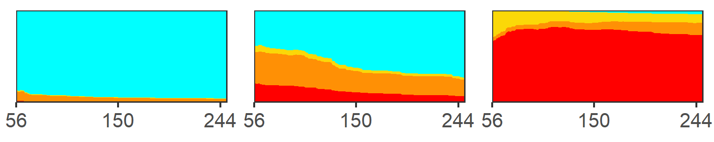

\newcommand{\1}{\textbf{1}}

Yuan Yu^1^, W. Alton Russell^1^, others

<br>

^1^School of Population and Global Health, McGill University, Montreal, Canada

<br>

**Corresponding author:** Yuan Yu

**Key words:** Blood Donor; COVID-19; Surveillance; Bayesian multilevel regression; CAR

**Running title:**

##### 

```{r setup, include=FALSE}
library(ggplot2) #plots
library(data.table) #for using datatables instead of frames
library(scales) #formatting plot legends and text
library(readxl) #read.excel
library(flextable) #generating tables
library(ftExtra)
library(officedown) #formatting for word
library(officer)
library(stringr)
theme_set(theme_bw())
knitr::opts_chunk$set(
  echo       = FALSE,
  message    = FALSE,
  warning    = FALSE
)

#takes table column containing references for sources
gen_tab_sourcestr <- function(sources_raw){
  sources <- str_match(sources_raw, ".*\\[@\\s*(.*?)\\s*\\]")[,2]
  #remove NA
  sources <- sources[!is.na(sources)]
  #attack '@
  sources <- paste0("@", sources)
  #add commas
  sources[-length(sources)] <- paste0(sources[-length(sources)], "; ")
  sources <- paste0("[", paste0(sources, collapse=""), "]")
  return(sources)
}

```

```{r}
df_samp <- read_excel("../1_data/tables.xlsx", sheet = "sample")
sourcestr_t_samp <- gen_tab_sourcestr(df_samp$Source)
```

# Abstract (~250)

**Background:** The Canadian Blood Services (CBS) plays a major role in monitoring COVID-19 immunity levels in Canada through the testing of randomly selected blood donations. In this study, we assessed the correlation between demographic covariates COVID-19 seropositivity across three pandemic waves (Pre-Delta, Delta, and Omicron) in four regions (Ontario, British Columbia, Prairies region and Atlantic region). We also compared multilevel modeling approaches with or without spatial effects.

**Methods:** Multilevel Regression with the regular fixed effects, as well as different unstructured or structured random effects (ICAR prior) are evaluated to fit the CBS data across four major regions (Ontario, British Columbia, the Parries region and the Atlantic Region) during three pandemic waves (Pre-delta, Delta & Omicron). We conducted our analysis through brms which allows comparing varies GLM. 

**Results:** We used indivual covariates (age, sex, race) and neighborhood covariates (urbanicity, material and social depirvation) to predict COVID seropositivity. Multilevel modeling with structured random effects consistently provides a better model fit across the regions during each of the three waves, compared with generalized linear model with just fixed effects or the unstructured random effect only. However, the coefficient estimation from the posterior distribution shows that donation from a rural area tends to result in a higher seropositivity, especially for the Prairies region.  

**Conclusions:** We found that Bayesian multilevel models with conditional autoregressive priors explained most of the variation in COVID-19 seropositivity when using individual factors and spatial factors. Our findings highlight how Bayesian multilevel modeling using antibody test data can provide valuable insights into COVID-19 immunity levels in the population, informing policymaking.  It is crucial to control the increasing seropositivity by adding the month covariate, especially during Omicron period as the significant trend involves. Though it is counterfactual from our initial guess that people from urban areas are more likely to be infected by living under larger population density, it indicates that we might need to incorporate other covariates like vaccination status and more general self-precaution being carried-out. It is also showed from other studies that the high seropositivity may cause by less precautions from rural areas.

##### 

# Introduction

> Citation [@Langham2018a]

<br>

# Methods


## Data

> See `r run_reference("f-sample")`. See `r run_reference("f-sample-2")`.

## Modeling method

> Modeling each region separately

> Multilevel model without spacial effects

> Multilevel model with spatial effects

<br>

# Results

## Selecting model approach

> A

## Predictors of seropositivity by region and wave


## Predicitons by census division


<br>

# Discussion

> Our study focused on how the socio-demographic feature will affect the overall seropositivity the coefficient estimation of area-level covariates like social/material deprivation index quantiles, particularly for urban/rural effect across different pandemic waves. We expected that in the beginning stage of the outbreak of SARS-CoV-2, which is the first wave, living in the urban tends to higher opportunity of the infection, yet not obvious. As the epidemic grow to the later waves, especially Omicron stage, the effect of urban or rural begins to wane as the gradually released public health policy in the omicron period. 

<br>

##### 

# Declarations

**Funding:** A

**Conflicts:** A

**Ethics/Consent:** A

**Data and materials:** A

**Code availability:** A

**Authors' contributions:**

##### 

# References

::: {#refs}
:::

##### 

# Tables

## Table 1: Mean absolute bias by model type, region and wave


Model performance estimates for 3 models

##### 

# Figures

## Coefficients for individual and neighborhood covariates by COVID-19 wave and region


## Time trend for coefficient


```{r fig.width=5, fig.height=1}
fig_num <- run_autonum(seq_id = "fig",
                       pre_label = "Figure ",
                       bkm="f-sample",
                       bkm_all = TRUE,
                       prop = fp_text(bold=TRUE, underlined = TRUE))



block_caption("This is a figure caption.", 
              style = "Image Caption", 
              autonum = fig_num)

```

##### 

# Supplemental materials

<br>

# A. Supplement section

##### 

# Supplemental tables

## Characteristics of donors tested for COIVD-19 antibodies by neighborhood and individual characteristics

https://cran.r-project.org/web/packages/tableone/vignettes/introduction.html

tab3 <- CreateTableOne(vars = myVars, strata = "trt" , data = pbc, factorVars = catVars)
stratify by region
Include wave as one of the factors

## Widely applicable information criterion (WAIC) model type, region and wave

##### 

# Supplemental figures

## Timing of COVID serological testing by Canadian Blood Services

Ask Sheila to provide

## Posterior predicted seropositivity vs. observed seropositivy by census division: Modeling each census division individually

## Posterior predicted seropositivity vs. observed seropositivy by census division: Multilevel model without spacial effects

## Posterior predicted seropositivity vs. observed seropositivy by census division: Multilevel model with spatial effects


```{r}
#sfig_autonum <- run_autonum(seq_id = "sfig", pre_label = "Figure S", bkm="f-sample-2", start_at=1)
```

```{r, fig.width=5, fig.height=1}

sfig_num <- run_autonum(seq_id = "sfig", 
                       pre_label = "Figure S", 
                       bkm="f-sample-2",
                       bkm_all = TRUE,
                       prop = fp_text(bold=TRUE, underlined = TRUE))


block_caption("A figure caption.", 
              style = "Image Caption", 
              autonum = sfig_num)
```
